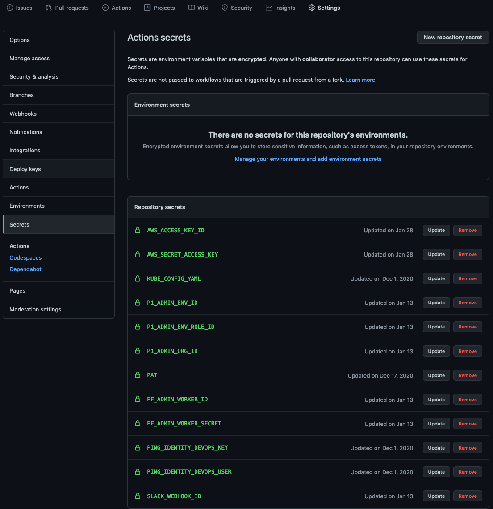

# Reference CI/CD Pipeline

**WORK IN PROGRESS**

This repository aims to provide a reference example of a development lifecycle with PingIdentity Software Products. 

## Current Features

- PingFederate GitOps :
  - Automatically builds new environments for feature-building
  - [profile script](ci_tools/pf_build_profile/pf_profile.sh) to _pull templated config based on current environment_. built with:
    - bulk-export tool
    - variablize
  - Diffs to show which env variables/secrets need to be added according to config.
- Using pingidentity/ping-devops Helm chart 
- PF key pair secrets in Vault
- PF.jwk as bitnami sealed secret

## Roadmap

- Licenses as bitnami sealed secret
- Docs on PF GitOps
- PD SSO from myping
- Health Dashboard 
  - Downtime Monitoring
- Continuous Traffic to prod

## Setup Github Actions. 

A few secrets are useful to keep in in the repository

Make the following secrets in your repository: 
Repository > Settings > Secrets > New Repository Secret

**KUBE_CONFIG_YAML**
A base64 version of your ~/.kube/config file

```
cat ~/.kube/config | base64 | pbcopy
```
add KUBE_CONFIG_YAML and paste clipboard as value

**AWS_ACCESS_KEY_ID** and **AWS_SECRET_ACCESS_KEY**

If using EKS, you also need to add AWS_ACCESS_KEY_ID and AWS_SECRET_ACCESS_KEY variables. 

**PING_IDENTITY_DEVOPS_USER** and **PING_IDENTITY_DEVOPS_KEY**

Eventually you will have something like:



## Security Holes

**Hole** - Postman collections are public.   
**mitigation** 
- postman collection with APIkey. 
- postman collection in github and pulled in with init container. 

**Hole** - Profiles in github
**mitigation**
- build profile into the image
- make sure github repo is private. 

<!-- **Hole** - Secrets in profiles. 
**mitigation**
- Use vault for secrets
- use k8s secrets for secrets. -->
