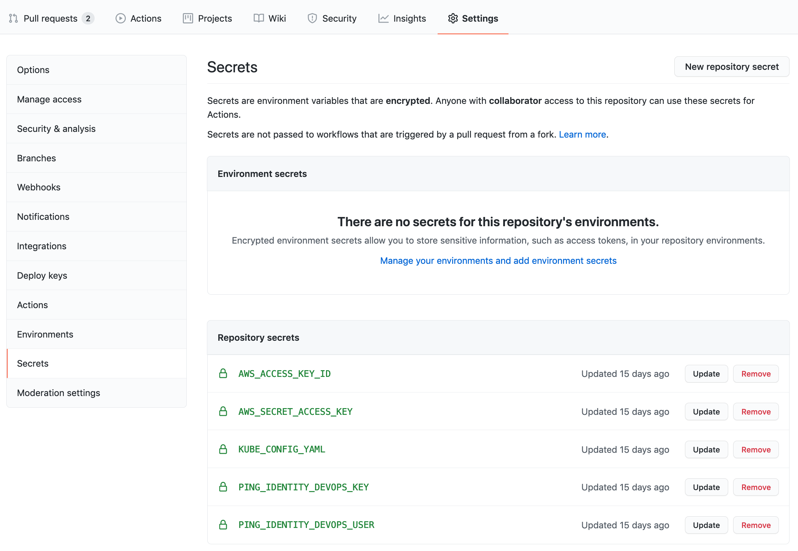

## Reference CI/CD Pipeline

**WORK IN PROGRESS**

This repository aims to provide a reference example of a development lifecycle with PingIdentity Software Products. 

## Setup Github Actions. 

A few secrets are useful to keep in in the repository

Make the following secrets in your repository: 
Repository > Settings > Secrets > New Repository Secret

**KUBE_CONFIG_YAML**
A base64 version of your ~/.kube/config file

```
cat ~/.kube/config | base64 | pbcopy
```
add KUBE_CONFIG_YAML and paste clipboard as value

**AWS_ACCESS_KEY_ID** and **AWS_SECRET_ACCESS_KEY**

If using EKS, you also need to add AWS_ACCESS_KEY_ID and AWS_SECRET_ACCESS_KEY variables. 

**PING_IDENTITY_DEVOPS_USER** and **PING_IDENTITY_DEVOPS_KEY**

Eventually you will have something like:



## Security Holes

**Hole** - Postman collections are public.   
**mitigation** 
- postman collection with APIkey. 
- postman collection in github and pulled in with init container. 

**Hole** - Profiles in github
**mitigation**
- build profile into the image
- make sure github repo is private. 

**Hole** - Secrets in profiles. 
**mitigation**
- Use vault for secrets
- use k8s secrets for secrets.

**Hole**
**mitigation**
-  
